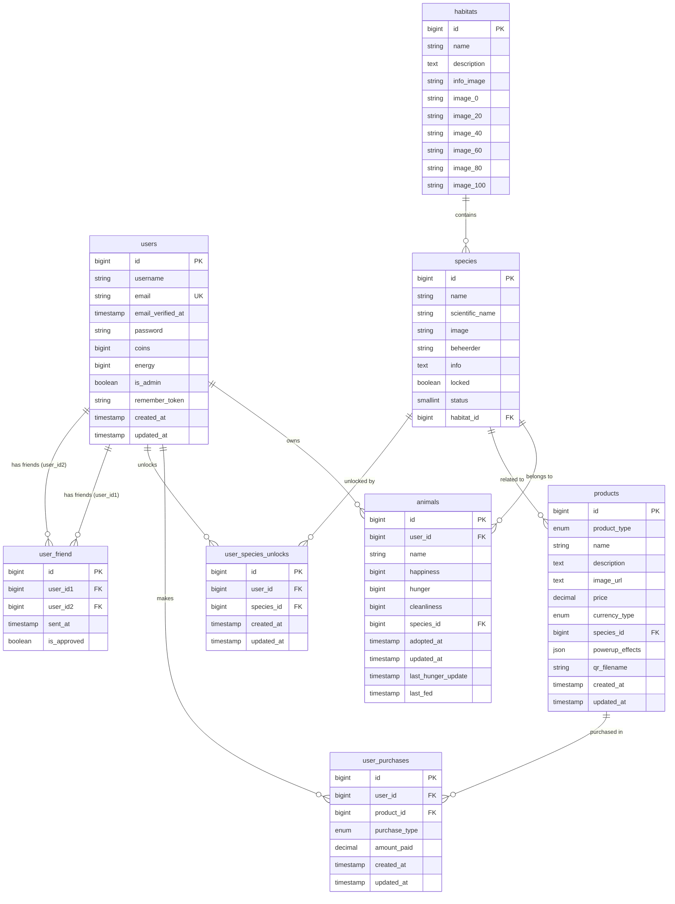

# NM-klikker
NMklikker is a web clicker game that allows users to play with animals from Natuurmonumenten.
User can view animals, habitats, and products to buy animals for the game.

## ER Diagram

## Contributing

1. Clone the repository to your local machine.
2. Copy `.env.example` to `.env`.
3. Install the project dependencies using [Composer](https://getcomposer.org) with `composer install`.
4. Install npm dependencies using `npm install`.
5. Run `php artisan key:generate` to generate the application key.
6. Run `php artisan migrate` to create the database tables (type yes if you are asked to create a `.sqlite` file).
7. Finally run the application with `composer run dev`.

## Deployment
NMklikker is hosted at: http://145.24.237.18

The host is a VPS Provided by the Rotterdam University of Applied Sciences running Ubuntu 24.04 server with nginx.

[These](https://github.com/HR-CMGT/PRG05-2025-2026/blob/main/deployment-tle/README.md) instructions were used to deploy the application.

## Built With

### Libraries & Packages

- [Laravel Breeze](https://github.com/laravel/breeze)
- [Blade MDI Icons](https://github.com/postare/blade-mdi)

## Edge cases
- When a user is created, that user automatically gets assigned a starter animal. For that to work there have to be species and habitats in the database. Seeders have been created to make that easier. Make sure to add `--seed` when migrating the database.
- Having too much coins could lead to an Integer overflow
